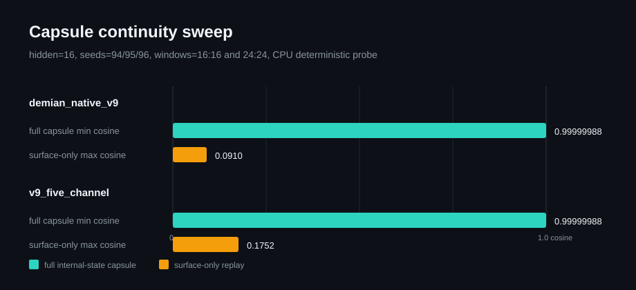
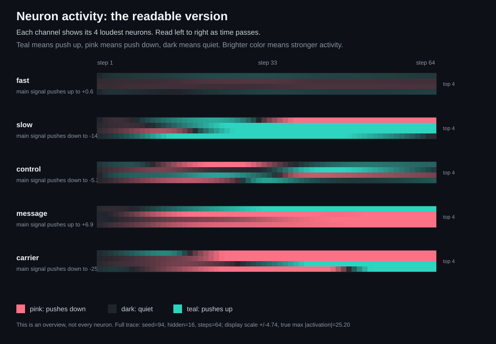
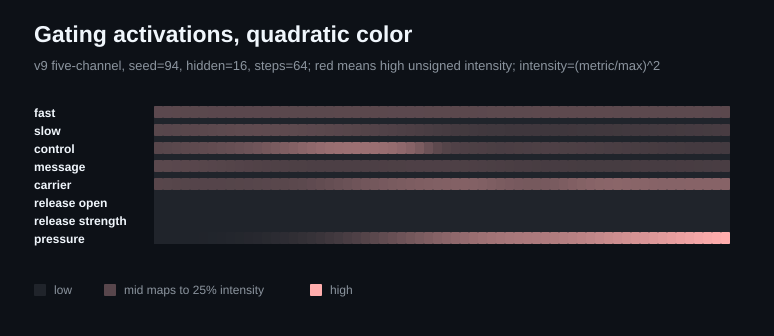
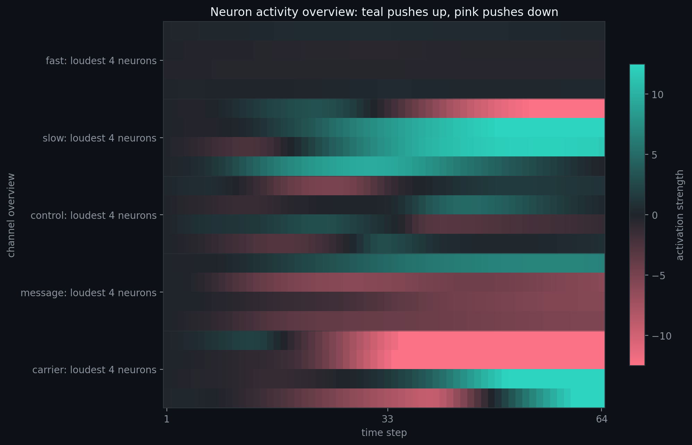
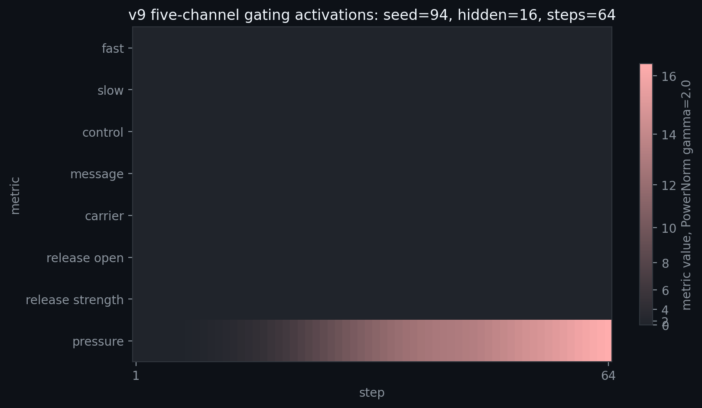
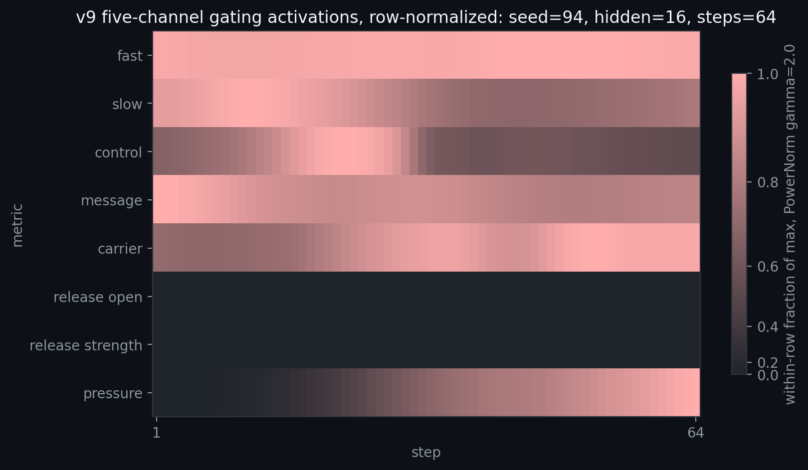

# Demian

Demian is the target native recurrent substrate: a custom architecture program
distilled from structured recurrence, gate-state causality, and substrate
lineage experiments.

[](https://github.com/Aeshma-Daeva/Demian/releases)
[](#environment)
[](LICENSE)
[](pyproject.toml)
[](docs/TECHNICAL_REPORT.md)

The surrounding repo is the Native Substrate Research Lab. It is not aimed at
productizing a chatbot, chasing benchmarks, or optimizing for human-facing
output quality. The working goal is to study how frozen and semi-adaptive AI
systems behave when their own internal state, recurrence, memory, and
inter-agent coupling become the substrate of continued evolution, then extract
the mechanisms that matter enough to build Demian.

## Plain-English Context

A neural network is a learned computation made from many small numeric units
whose connection weights are adjusted by data. A recurrent neural network
(RNN) adds feedback: part of its previous internal state is fed back into the
next step, so the system has a form of short-term memory and trajectory.

This project began by treating each recurrent framework as an experimental
substrate rather than as a finished model. The repo tests those substrates with
the same style of methodology: controlled probes, ablations, stress tests,
trajectory exports, visual diagnostics, and negative-result tracking. The
native line from `demian_native_v0` through v9 five-channel records what held
up, what failed, and which mechanisms kept reappearing.

`Demian v1` is the current synthesis step. It is not a clean-room invention;
it is an attempt to compress the findings from v0 through v9 five-channel into
a custom recurrent substrate. The cycle now repeats: build the synthesis, test
it the same way, preserve the failures, and use the evidence to decide the
next substrate rather than assuming the design is already solved.

**Strongest current result:** fixed-point surface behavior can hide structured internal channel dynamics, so surface labels alone are not enough to judge a substrate.

**Current boundary:** v9 five-channel is interesting and worth continuing; it is not yet evidence of global superiority over v8 or other baselines. `Demian v1` is a prototype/design consequence, not a completed empirical result.

Quick links: [Technical Report](docs/TECHNICAL_REPORT.md) | [Reproducibility](docs/REPRODUCIBILITY.md) | [Claims](docs/CLAIMS.md) | [Lineage](docs/RESEARCH_LINEAGE.md) | [Glossary](docs/GLOSSARY.md)

## At A Glance

The repo is publishable today as an ongoing research notebook with a clear
evidence ledger, not as a finished architecture announcement.

Current public center:

- **Primary line:** v9 five-channel substrate work (`fast`, `slow`, `control`, `message`, `carrier`) and the next named `Demian v1` program.
- **Fresh side result:** capsule-continuity probes show that full internal-state resume preserves trajectory continuation while surface-only replay fails in canonical v9 and v9 five-channel.
- **Main boundary:** current release-local causal effect remains weak, and archived v10 predecessor evidence is a falsification target rather than a stable finding.

For the complete historical trail from KV-cache transformer probes and Mamba
recurrence through native substrates, Track B discovery, and Demian v1
synthesis, read [docs/RESEARCH_LINEAGE.md](docs/RESEARCH_LINEAGE.md). The
front page is selective; the lineage doc preserves the full path of thought.

## Publication Entry Points

- [docs/TECHNICAL_REPORT.md](docs/TECHNICAL_REPORT.md): long-form GitHub report
  for the methodology, main result, negative results, and Demian v1 synthesis.
- [docs/ARXIV_OUTLINE.md](docs/ARXIV_OUTLINE.md): tighter paper structure for
  the first methods-first arXiv submission.
- [docs/GLOSSARY.md](docs/GLOSSARY.md): translation layer from Demian terms to
  standard ML and dynamical-systems terminology.
- [docs/REPRODUCIBILITY.md](docs/REPRODUCIBILITY.md): compact CPU commands and
  expected result shapes.
- [docs/RESEARCH_LINEAGE.md](docs/RESEARCH_LINEAGE.md): complete historical
  trail and legacy-mode chronology.

## Visual Readouts

These figures are deterministic code-generated diagnostics, not AI-generated
art. They are meant as inspection surfaces for traces, probes, and substrate
state, not as decorative illustrations.

### How These Figures Were Made

- **Probe summary figure:** `docs/assets/capsule_continuity.svg` is generated
  from the capsule-continuity probe summary.
- **Trace-derived activation heatmaps:** the neuron and gate SVG/PNG figures
  are generated from deterministic v9 five-channel traces by
  `development/render_publication_2d_visuals.py`.
- **Machine-native diagnostic renders:** the machine visual groups are
  generated from trajectory exports by `development/render_machine_visuals.py`.

### Probe Summary Figure



### Trace-Derived Activation Heatmaps





The neuron overview is meant to be readable without knowing the model internals:
read left to right over time, with each channel showing only its four loudest
neurons. Berlin scientific colors show blue for upward activation, red for
downward activation, and dark for quiet. This is an overview for humans, not
the full dense trace.

The gate heatmaps still use quadratic color intensity for compact comparison.
Matplotlib PNG variants are also generated for export with the same dark
near-zero baseline. Unsigned magnitude and intensity metrics use a dark-to-red
scientific sequential palette with `PowerNorm(gamma=2.0)`, while signed or
centered data keeps a red/blue diverging palette with an explicit midpoint. The
row-normalized gate variant is an inspection view:
each metric row is scaled to its own maximum, so it should not be read as a
cross-metric magnitude comparison.







### Machine-Native Diagnostic Renders

Machine-native diagnostics are generated from `trajectory_3d.json` exports by
`development/render_machine_visuals.py`. These prioritize event locality,
state deltas, recurrence, channel separation, spectral structure, and candidate
frontiers over visual polish.

- [event-aligned release windows](docs/assets/machine_visuals/event_aligned_release_windows.png)
- [release variant comparison](docs/assets/machine_visuals/release_variant_comparison.png)
- [state delta heatmap](docs/assets/machine_visuals/state_delta_heatmap.png)
- [recurrence distance](docs/assets/machine_visuals/recurrence_distance.png)
- [channel separation covariance](docs/assets/machine_visuals/channel_separation_covariance.png)
- [phase portraits](docs/assets/machine_visuals/phase_portraits.png)
- [spectral channel power](docs/assets/machine_visuals/spectral_channel_power.png)
- [evolution Pareto frontier](docs/assets/machine_visuals_evo/pareto_frontier.png)
- [evolution release/geometry surface](docs/assets/machine_visuals_evo/sweep_surface_release_vs_geometry.png)
- [16-seed release variant comparison](docs/assets/machine_visuals_seed_sweep/release_variant_comparison.png)
- [v10 predecessor island-1 release comparison](docs/assets/machine_visuals_v10_island1/release_variant_comparison.png)
- [v10 predecessor island-1 Pareto frontier](docs/assets/machine_visuals_v10_island1/pareto_frontier.png)

The 2026-05-11 v10 continuation added held-out CPU checks for the top island
candidates:
[seed-94 reproduction sanity check](data/substrate_lab/v10_frozen_repro_seed94_20260511/summary.csv),
[held-out release-gain ablation](data/substrate_lab/v10_frozen_cross_eval_20260511/summary.csv),
and [held-out release-route ablation](data/substrate_lab/v10_frozen_cross_eval_routes_20260511/summary.csv).
These are falsification artifacts. They currently argue that the archived v10
predecessor result is not ready to publish as a stable finding: CPU reruns do
not exactly reproduce the archived CUDA metrics, held-out release duty floods,
and zeroing release routes barely changes the held-out behavior.

Public status:

- ongoing computational research notebook
- not a finished architecture claim
- not evidence that v9 five-channel globally dominates v8 or other baselines
- strongest current result: fixed-point surface behavior can hide rich channel-internal dynamics, and sparse release gates can be selected without simply becoming always-on coupling

Current focus:

- v9 five-channel experiments (`fast`, `slow`, `control`, `message`, `carrier`) as the active scaffold and evidence line
- `Demian v1` as the next named custom-substrate program distilled from v9 five-channel evidence
- capsule-continuity as a focused side thread: internal-state resume versus surface-only replay
- canonical `demian_native_v9` as the minimal 3-channel baseline for that direction
- `demian_native_v8` as the immediate 7-channel comparison line
- `demian_native_v7.4` as the promoted organ-heavy historical baseline
- `demian_native_v7.2`, `demian_native_v7.1`, `demian_native_v6`, `demian_native_v5.2c`, `demian_native_v3`, `demian_native_v2`, `demian_native_v1`, and `demian_native_v0` as ancestry/comparison lines
- architecture dissection across transformer, Mamba, and native self-loop substrates
- AI-only optimization criteria grounded in machine observables
- custom-substrate design and iteration, not just mechanism extraction from inherited cells
- non-anthropocentric observables
- structural metrics over language quality
- conditions for persistence, divergence, basin shift, recruitment, and transmissible memory
- perturbation path geometry, shape incorporation, and rare release without incoherence

Older transformer experiments remain in the repo because they established an important baseline:

- transformer self-reference tends toward a deterministic 2-cycle
- Mamba self-reference tends toward a fixed-point basin with rich micro-motion

## Orientation

- [docs/CURRENT_STATE_AND_ROUTING.md](docs/CURRENT_STATE_AND_ROUTING.md): OpenClaude/NanoGPT restart map, latest substrate artifacts, and model routing presets
- [docs/TECHNICAL_REPORT.md](docs/TECHNICAL_REPORT.md): GitHub long-form publication report
- [docs/ARXIV_OUTLINE.md](docs/ARXIV_OUTLINE.md): first-paper outline and figure/table plan
- [docs/GLOSSARY.md](docs/GLOSSARY.md): Demian-to-standard terminology map
- [docs/REPRODUCIBILITY.md](docs/REPRODUCIBILITY.md): compact CPU checks and artifact inspection commands
- [docs/WORKING_STATE.md](docs/WORKING_STATE.md): one-page active truth, restart file, and current priorities
- [docs/SUBSTRATE_ANATOMY.md](docs/SUBSTRATE_ANATOMY.md): stable channel/routing anatomy for v9 five-channel and Demian v1 work
- [docs/EXPERIMENT_NAMING.md](docs/EXPERIMENT_NAMING.md): separates scaffold names, artifact names, and next custom-substrate program names
- [docs/CAPSULE_CONTINUITY.md](docs/CAPSULE_CONTINUITY.md): focused capsule-resume thread for v9 and v9 five-channel
- [docs/LABBOOK.md](docs/LABBOOK.md): append-only experiment chronology for fast-moving run details
- [docs/RESEARCH_MAP.md](docs/RESEARCH_MAP.md): project spine, empirical findings, and working loop
- [docs/CLAIMS.md](docs/CLAIMS.md): active claims with evidence level and falsification lines
- [docs/EXPERIMENT_RULES.md](docs/EXPERIMENT_RULES.md): anti-drift interpretation standard
- [docs/REPO_INVENTORY.md](docs/REPO_INVENTORY.md): active, historical, generated, and operational repo surfaces
- [docs/DEVELOPMENT_SCRIPT_MAP.md](docs/DEVELOPMENT_SCRIPT_MAP.md): classification of `development/*.py` before file moves
- [docs/SUBSTRATE_LAB_DEPENDENCIES.md](docs/SUBSTRATE_LAB_DEPENDENCIES.md): import map for scripts depending on the legacy lab
- [data/INDEX.md](data/INDEX.md): artifact map for named findings
- [data/MANIFEST.json](data/MANIFEST.json): machine-readable artifact manifest and run status map
- [docs/archive/README.md](docs/archive/README.md): older notebooks, plans, and reference material

## Main Tracks

Top-level layout is intentionally small:

- `development/`: active substrate, evolution, diagnostics, and current
  research code.
- `docs/`: publication, claims, reproducibility, lineage, and restart surfaces.
- `data/`: indexed artifacts and summaries.
- `legacy/`: older runtime package and root-era CLIs kept for ancestry and
  baseline reproduction.
- `scripts/` and `visualization/`: operational renderers and viewers.
- `tests/`: active verification surface.

- `development/substrate_lab.py`
  Historical architecture lab. It still contains the full substrate lineage and compatibility API, but do not use it as the first read surface.

- `development/substrates/current.py`
  Current workbench: Demian v1 metadata, v10 predecessor evidence loader, and v9/v8/v7.4 substrate comparison wrappers.

- `development/evolution/`
  Current v9 five-channel and Demian v1 helpers: metadata, artifact validation, scoring, lineage, and generation diagnostics.

- `development/probe_v9_message_carrier_strange.py`
  Current v9 five-channel probe surface: message/carrier accumulation and manual, pressure, or learned release gates.

- `development/probe_v9_capsule_continuity.py`
  Focused capsule-continuity probe: full internal-state resume versus surface-only replay for canonical v9 and v9 five-channel.

- `development/evolve_v9_5ch_release.py`
  Compatibility CLI for v9 five-channel release evolution. The old `v10.0-frozen-evolution` run is predecessor evidence for Demian v1.

- `development/summarize_v9_5ch_evolution.py`
  Rebuilds compact summaries from v9 five-channel and predecessor island candidate outputs. Use this instead of ad hoc aggregation snippets.

- `development/cross_eval_v10_frozen.py`
  Held-out CPU cross-evaluation and release ablation driver for archived v10.0 predecessor candidates.

- `scripts/render_v9_expression_blender.py`
  Deterministic Blender expression renderer for trajectory artifacts. This is a visualization bridge, not symbolic art output.

- `legacy/root_cli/run_competition.py` / `legacy/demian_runtime/competition.py`
  Legacy multi-agent Mamba dynamics with continuity pressure, inheritance, communication field, and optional Hebbian fast weights.

- `legacy/root_cli/run_mamba_batch.py` / `legacy/demian_runtime/mamba_reservoir.py`
  Legacy single-agent Mamba self-reference baseline. Useful for understanding fixed-point topology before adding population dynamics.

- `legacy/root_cli/run_reservoir_batch.py` / `legacy/demian_runtime/reservoir.py`
  Legacy transformer reservoir baseline. Important because it established the strong period-2 attractor.

- `legacy/demian_runtime/machine_observables.py`
  The non-anthropocentric measurement layer. Structural observables, attractor classification, compact notation.

- `legacy/demian_runtime/hebbian.py`
  Fast-weight adaptation layer for moving beyond purely frozen recurrence.

## How To Read The Repo

Start from the architecture-dissection path, not the old transformer-only path:

1. `docs/WORKING_STATE.md`
2. `docs/CURRENT_STATE_AND_ROUTING.md`
3. `docs/SUBSTRATE_ANATOMY.md`
4. `docs/EXPERIMENT_NAMING.md`
5. `docs/CAPSULE_CONTINUITY.md`
6. `docs/LABBOOK.md`
7. `docs/CLAIMS.md`
8. `development/substrates/current.py`
9. `development/evolution/`
10. `development/evolve_v9_5ch_release.py`
11. `docs/REPO_INVENTORY.md`
12. `docs/DEVELOPMENT_SCRIPT_MAP.md`
13. `docs/SUBSTRATE_LAB_DEPENDENCIES.md`
14. `data/INDEX.md` and `data/MANIFEST.json`
15. `development/substrate_lab.py`, but only targeted ranges around `DemianNativeV9Substrate` and `compare_native_v9_vs_v8` unless broader ancestry is needed

Use the transformer and Mamba code as fingerprint baselines, not as the design destination.

## Experiment Artifacts

Important result directories:

- `data/evolution/v10_0_frozen_evolution_4island_20260510_summary.json`: predecessor evidence for Demian v1; keep the artifact name stable
- `data/evolution/v9_5ch_release_20260509_full/`: prior full v9 five-channel evolutionary archive
- `data/substrate_lab/v9_5ch_evo_trajectory_3d_20260509_full/`: prior evolved v9 five-channel 3D export and Blender expression artifact
- `data/substrate_lab/v9_release_gate_trajectory_3d_20260509/`: v9 message/carrier release-gate trajectory export
- `data/substrate_lab/v9_capsule_continuity_20260511/summary.json`: capsule-continuity probe for canonical v9 and v9 five-channel
- `data/substrate_lab/v9_v8_compare_20260508/`: current compact v9-v8 diagnostic comparison
- `data/reservoir_batch/`: transformer period-2 baseline
- `data/mamba_batch/`: Mamba fixed-point baseline
- `data/competition50/`: first 50-agent competition run
- `data/competition50_run2/`: second 50-agent competition run
- `data/competition_v3/`: newer competition run
- `data/competition_hebbian/`: competition with fast-weight adaptation

There is also a local summarizer:

```bash
./venv/bin/python development/summarize_results.py
```

## Reproduce A Small Check

This CPU-only check compares canonical `demian_native_v9` against `demian_native_v8`
on one short seed. It is a smoke test and orientation path, not a full evidence
rerun:

```bash
./venv/bin/python -c "from development.substrates.current import compare_current_target; import json; r=compare_current_target(hidden_size=16, steps=16, perturb_step=8, seeds=[94], device='cpu'); print(json.dumps({'seeds': r['seeds'], 'mean_v9_recovery_1.0': r['aggregate'].get('mean_v9_recovery_1.0'), 'mean_v8_recovery_1.0': r['aggregate'].get('mean_v8_recovery_1.0')}, indent=2))"
```

Expected shape:

```json
{
  "seeds": [94],
  "mean_v9_recovery_1.0": 0.07895439697636498,
  "mean_v8_recovery_1.0": 0.04398368299007416
}
```

The exact values can move with runtime/library details; the public contract is
that the command runs and returns the listed keys.

For the current v9 five-channel / Demian v1 evidence path:

```bash
./venv/bin/python -m pytest tests/test_current_substrates.py tests/test_v9_5ch_summary.py -q
```

For the capsule-continuity side thread:

```bash
./venv/bin/python development/probe_v9_capsule_continuity.py --hidden-size 16 --pause-steps 24 --resume-steps 24 --seeds 94,95,96 --windows 16:16,24:24
./venv/bin/python -m pytest tests/test_v9_capsule_continuity.py -q
```

## Environment

The local `venv` has the research runtime more reliably than the system interpreter.

Examples:

```bash
./venv/bin/ruff check development tests
./venv/bin/ruff format --check development/lab_schemas.py development/lab_tools.py development/validate_lab_artifact.py tests/test_lab_tooling.py
./venv/bin/python development/validate_lab_artifact.py data/evolution/v10_0_frozen_evolution_4island_20260510_summary.json
./venv/bin/python development/update_docs.py
./venv/bin/python development/run_substrate_tests.py
./venv/bin/python -m pytest tests/test_current_substrates.py
./venv/bin/python -m pytest tests/test_v9_5ch_evolution.py
./venv/bin/python development/summarize_v9_5ch_evolution.py data/evolution/v10_0_frozen_evolution_island_*_20260510 --experiment v10.0-frozen-evolution --eval-seed 94 --out /tmp/demian_v1_predecessor_summary.json
./venv/bin/python -c "from development.substrates.current import compare_current_target; import json; print(json.dumps(compare_current_target(seeds=[94], steps=64), indent=2))"
./venv/bin/python legacy/root_cli/run_mamba_batch.py --runs 3 --steps 1000
./venv/bin/python legacy/root_cli/run_competition.py --n-agents 50 --rounds 500 --machine-driver
./venv/bin/python development/summarize_results.py
```

To continue repo work in OpenClaude through rotating OpenRouter free models:

```bash
printf 'OPENROUTER_API_KEY=sk-or-v1-...\n' > .env
python3 scripts/openclaude_openrouter.py
```

To route OpenClaude through NanoGPT model presets:

```bash
export NANOGPT_API_KEY='...'
python3 scripts/openclaude_nanogpt.py --role code
python3 scripts/openclaude_nanogpt.py --role reason
```

See [docs/OPENCLAUDE_OPENROUTER.md](docs/OPENCLAUDE_OPENROUTER.md).
See [docs/CURRENT_STATE_AND_ROUTING.md](docs/CURRENT_STATE_AND_ROUTING.md) for current substrate state and routing guidance.

## Current Software Caveats

- This repo is an active lab, not a stabilized package.
- Some older tests and scripts still reflect pre-geometric `mode` terminology.
- Full pytest on 2026-05-11 passes locally: `161 passed in 31.46s`.
- Do not dismiss `FIXED_POINT` regimes as boring by default. Current v9 five-channel evidence shows `surface_fixed_accumulating` can coexist with internal richness and other bounded regimes.
- archived notes and plans are useful context, but they are not a substitute for checking raw artifacts.

The correct standard here is not product polish, benchmark wins, or human approval. It is clarity of structure, experimental traceability, and avoiding anthropocentric interpretation drift while isolating machine-useful principles.
