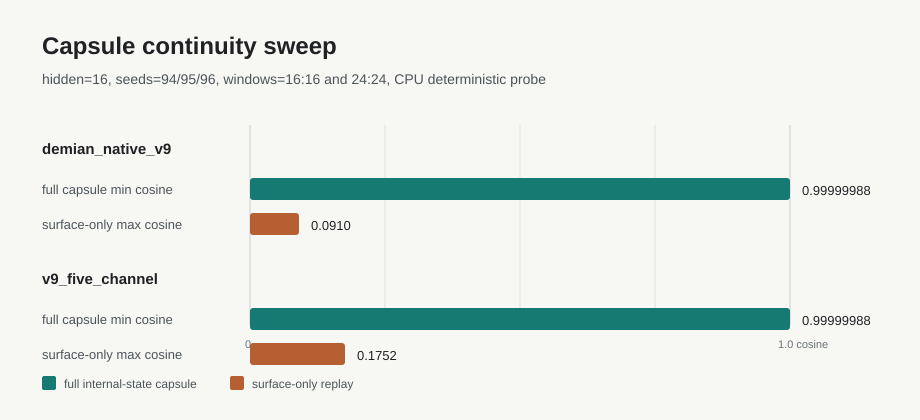

# Capsule Continuity

Last updated: 2026-05-11

## Purpose

The capsule-continuity thread asks a narrow question:

> Can a compact internal substrate state resume a trajectory better than
> replaying only the exposed surface state?

This is related to, but separate from, the main v9 five-channel evolution work.
It is a candidate for a future focused repository after Demian is published.

## Current Result

The first v9 replication probe is:

- code: [development/probe_v9_capsule_continuity.py](/home/xenith/demian/development/probe_v9_capsule_continuity.py)
- test: [tests/test_v9_capsule_continuity.py](/home/xenith/demian/tests/test_v9_capsule_continuity.py)
- artifact: [data/substrate_lab/v9_capsule_continuity_20260511/summary.json](/home/xenith/demian/data/substrate_lab/v9_capsule_continuity_20260511/summary.json)

It compares uninterrupted continuation with:

- full capsule: restored model body and full internal state
- surface-only: empty state with only the exposed surface rewritten
- body-only: restored model body with empty state
- component-only: one internal component restored into an empty state

## Compact Readout



| Substrate | Full capsule cosine | Surface-only cosine | Best component-only read |
| --- | ---: | ---: | --- |
| `demian_native_v9` | `0.99999994` | `0.09100710` | `slow_only`: `0.99973315` |
| `v9_five_channel` | `1.0` | `-0.03007574` | partial continuity spreads across `carrier`, `message`, and `slow` |

Mean trajectory gap also separates the arms:

| Substrate | Full capsule gap | Surface-only gap |
| --- | ---: | ---: |
| `demian_native_v9` | `0.0` | `0.25749409` |
| `v9_five_channel` | `0.0` | `0.30981059` |

The current smoke sweep uses seeds `94,95,96` and pause/resume windows `16:16`
and `24:24`. In all 6 runs per substrate, full capsule resume remains exact
or near-exact (`min cosine > 0.999`, `max mean gap = 0.0`), and surface-only
replay is worse than full capsule resume.

## Interpretation

This supports a narrow operational claim: on canonical v9 and v9 five-channel,
the exposed surface alone is not sufficient to resume the trajectory, while the
internal state capsule is sufficient under the deterministic probe setup.

It does not yet prove compressed capsule continuity. The current full capsule
restores the full internal tensor state. The next question is whether a smaller
capsule can preserve the same continuation advantage.

## Next Checks

- repeat across seeds and longer pause/resume windows
- test compressed capsules, not only full internal state restore
- test whether `slow`, `message`, and `carrier` can be reduced to a small
  structured code while preserving resume quality
- keep this separate from v7.4 until the v9/v9-five-channel behavior is stable

## Reproduce

```bash
./venv/bin/python development/probe_v9_capsule_continuity.py --hidden-size 16 --pause-steps 24 --resume-steps 24 --seeds 94,95,96 --windows 16:16,24:24
./venv/bin/python -m pytest tests/test_v9_capsule_continuity.py -q
```
